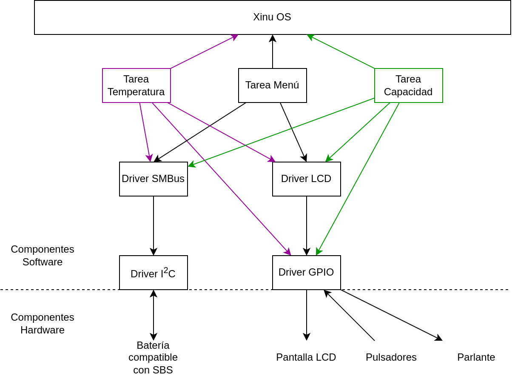
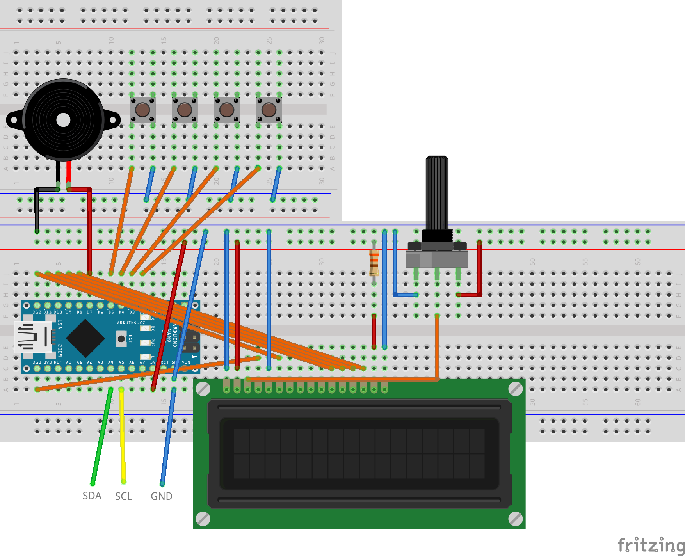

# Analizador de baterías

El proyecto es un sistema autónomo que sirve para hacer un diagnostico detallado a las baterías de computadoras portátiles como así también modificar algunos parámetros de las mismas. Además de advertir automáticamente mediante señales sonoras y visuales de las situaciones que degradan la salud de la batería, es decir una capacidad restante muy baja y/o una temperatura muy alta.

Esto es posible ya que la mayoría de las baterías cumplen con la Smart Battery Data Specification (SBS), una especificación que sigue el circuito integrado de las mismas y se encarga de almacenar datos del estado de la batería (Capacidad, Desgaste, Consumo, ...) como así también los parámetros de configuración (Voltaje de carga, Corriente de carga, Valores críticos, ...). Además dicho circuito integrado cuenta con una interfaz compatible con el protocolo SMBus mediante la cual se comunica tanto con el cargador de la batería como con la computadora portátil que la usa.

Por ello es que el sistema desarrollado utiliza la interfaz I²C (de la cual SMBus es un subconjunto y por lo tanto compatible) presente en el Arduino Nano para comunicarse con el circuito integrado de la batería. El sistema permite al usuario navegar por una interfaz gráfica dibujada en una pantalla LCD utilizando 4 botones con las funciones izquierda, derecha, volver atrás/cambiar dígito y entrar. Se puede elegir ejecutar una serie de comandos de consulta como asi también de escritura, en este último caso se permite especificar los dígitos a enviar. Además un parlante avisa de manera automática si la capacidad de la batería es muy baja y/o si la temperatura de la batería es muy alta, indicando además ambas situaciones en la pantalla LCD.

Utilizando el SO Xinu RTOS, se realizan de manera concurrente las siguientes tareas ordenadas por prioridad (número más alto indica mayor prioridad y mismo número indica prioridad compartida):
- (2) *Tarea Capacidad*: Reproducir por el parlante un tono grave si la capacidad de la batería es inferior a la de alarma almacenada en la batería e indicar dicha situación en el LCD.
- (2) *Tarea Temperatura*: Reproducir por el parlante un tono agudo si la temperatura de la batería excede un valor fijado en el código (por defecto 27ºC) e indicar dicha situación en el LCD.
- (1) *Tarea Menú*: Dibujar y gestionar en el LCD una IU basada en menús. Su funcionamiento y los menús se describen en la sección [Funcionamiento de la IU](https://github.com/YoAlejandro/PSE-TPF?tab=readme-ov-file#funcionamiento-de-la-iu).

La **Tarea Menú** implementa, además de la IU, la mayoría de los comandos en la especificación SBS, los cuales fueron definidos por el SBS Forum (un foro de los principales fabricantes de baterías) en el documento http://sbs-forum.org/specs/sbdat110.pdf, cada comando está identificado por un número hexadecimal que se envía como un mensaje SMBus.

El diagrama de bloques del sistema es el siguiente, en donde las flechas del area *Componentes Software* indican dependencias mientras que en el area *Componentes Hardware* indican el flujo de la información:

Nota: hay flechas en distinto color para poder diferenciarlas mejor, el color no tiene ningún significado especial.

## Funcionamiento de la IU

La IU consta de una serie de menús ordenados por niveles. Presionando los pulsadores *izquierda* y *derecha* es posible desplazarse entre los menús de un nivel determinado mientras que presionando el pulsador *arriba* se asciende al nivel anterior y presionando el pulsador *abajo* se desciende al siguiente nivel de la opción actual o bien se ejecuta la acción asignada en el caso de no disponer de un siguiente nivel.

En el caso de que la acción pertenezca al menú *Comandos de escritura* se deben ingresar los dígitos que se enviarán como argumento. Presionando los pulsadores *izquierda* y *derecha* es posible desplazarse entre los dígitos mientras que presionando el pulsador *arriba* se incrementa el dígito actual (volviendo a 0 en el caso de ser 9) y presionando el pulsador *abajo* se confirma la secuencia de dígitos como argumento.

Los menús y acciones implementadas son:

1. Comandos de consulta
    - Alarma de capacidad restante
    - Alarma de tiempo restante
    - Temperatura actual
    - Voltaje actual
    - Corriente actual
    - Corriente promedio
    - Error máximo
    - Carga relativa
    - Carga absoluta
    - Capacidad restante
    - Capacidad total
    - Tiempo restante
    - Tiempo promedio a vacía
    - Tiempo promedio a llena
    - Corriente de carga
    - Voltaje de carga
    - Ciclos de carga
    - Capacidad de diseño
    - Voltaje de diseño
    - Información de la especificación
    - Fecha de fabricación
    - Número de serie
    - Nombre del fabricante
    - Nombre del dispositivo
    - Química
2. Comandos de escritura
    - Alarma de capacidad restante
    - Alarma de tiempo restante

> [!IMPORTANT]
> La especificación define más comandos de escritura, pero los mismos no fueron implementados debido al potencial riesgo de desconfigurar la batería.

# Hardware

Se requiere:
- 1 Arduino Nano
- 1 Potenciómetro de 10kΩ
- 1 Pantalla LCD 16x2 con chip HD44780 (o compatible)
- 1 Parlante piezoeléctrico
- 1 Resistencia de 330Ω
- 4 Pulsadores
- 1 Batería compatible con la especificación SBS

Las conexiones son:
- Pin 5V de Arduino Nano a VCC de protoboard
- Pin GND de Arduino Nano a GND de protoboard
- Pin D2 de Arduino Nano a pin izquierdo de Pulsador 1
- Pin D3 de Arduino Nano a pin izquierdo de Pulsador 2
- Pin D4 de Arduino Nano a pin izquierdo de Pulsador 3
- Pin D5 de Arduino Nano a pin izquierdo de Pulsador 4
- Pin derecho de los pulsadores a GND de protoboard
- Pin D7 de Arduino Nano a positivo de Parlante
- Pin negativo de Parlante a GND de protoboard
- Pin D8 de Arduino Nano a pin D7 de LCD
- Pin D9 de Arduino Nano a pin D6 de LCD
- Pin D10 de Arduino Nano a pin D5 de LCD
- Pin D11 de Arduino Nano a pin D4 de LCD
- Pin D12 de Arduino Nano a pin E de LCD
- Pin D13 de Arduino Nano a pin RS de LCD
- Pin K de LCD a GND de protoboard
- Pin A de LCD a un extremo de la resistencia
- El otro extremo de la resistencia a VCC de protoboard
- Pin RW de LCD a GND de protoboard
- Pin V0 de LCD a pin central de potenciómetro
- Pin izquierdo de potenciómetro a GND de protoboard
- Pin derecho de potenciómetro a VCC de protoboard
- Pin VDD de LCD a VCC de protoboard
- Pin VSS de LCD a GND de protoboard
- Pin A4 de Arduino Nano a pin SDA de la batería
- Pin A5 de Arduino Nano a pin SCL de la batería
- Pin GND de la batería a GND de protoboard

> [!CAUTION]
> Asegurarse de que los pines de la batería sean los correctos, caso contrario se corre el riesgo de que el Arduino Nano y/o los demás componentes sufran **daños irreversibles**.

El circuito resultante debería ser similar al siguiente:

# Instalación del software

Grabar en el Arduino Nano con consola abierta en el directorio *compile*:
1. make clean
2. make all
3. make flash

En caso de error, comprobar que el Arduino Nano esté correctamente conectado y que la variable PUERTO del Makefile coincida con el reportado por _ls /dev_, también probar cambiando variable BPS por 57600.
